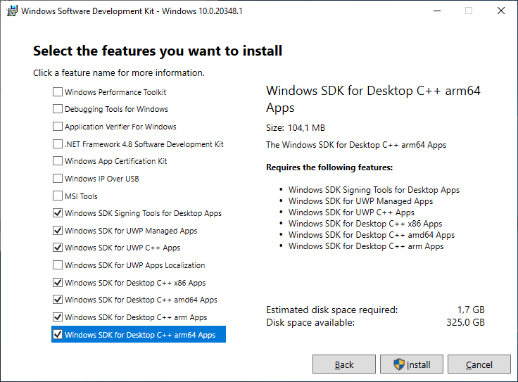

# Previous note

Most of the recipes and classes included in this project were widely adopted from the
[basement project](https://github.com/BobBuildTool/basement). But since the project
currently only supports bash as shell script language, this is a attempt to introduce
the PowerShell script language to be used on native windows without MSYS. For this, the
recipes and classes were ported from bash to PowerShell as far as possible.

# Native Windows Basement

These basement project is a collection of useful recipes and classes that can be used by other
projects. Most importantly it provides standard classes to handle common build systems and other
standard tasks. Optional a native host clang and common GCC as well as an embedded LLVM toolchain
are ready-to-use.

# Prerequisites

* A x86_64 system with Windows 10 and some minimal tools installed
  * Visual Studio Build Tools 2019 with minimal settings:
    
  * [Windows 10 SDK version 10.0.20348.1](https://go.microsoft.com/fwlink/?linkid=2164145)
    The Windows SDK is required to build the position independent Python 3.11.x
    
  * powershell 5.x

* Windows 10 system configuration
  * Make sure you can create symbolic links without admin rights. Usually you can enable
    this by switching to the developer mode. If this does not work, enable it in your
    [security policy setting](https://docs.microsoft.com/en-us/windows/security/threat-protection/security-policy-settings/create-symbolic-links).
  * [Enable long path support](https://www.msftnext.com/how-to-enable-ntfs-long-paths-in-windows-10/).

* git for windows (https://gitforwindows.org/)
* Bob Build Tool (https://github.com/BobBuildTool/bob) with minimum version v0.23.1

# How to build

There is the possibility to choose between two different host toolchains.

By default, the MSVC 2019 compiler (vc142) is configured as host toolchain. If you want to use
clang as host toolchain you can switch to it by modifying the environment variable
`ENABLE_X86_64_CLANG_HOST_TOOLCHAIN` which is defined in the `default.yaml` located in the root
directory of this repository.

```yaml
    # This will enable/disable the clang host toolchain if required by the user. If set to
    # "True" some initial tools will be bootstrapped using the native MSVC compiler because
    # they are required to build the clang toolchain. After building the clang toolchain, the
    # clang toolchain earns the role of the master host toolchain.
    # If set to "False" the MSVC compiler becomes the master host toolchain.
    ENABLE_X86_64_CLANG_HOST_TOOLCHAIN: "False"
```

While building the clang host toolchain, take care using a flat folder structure. Regardless of
whether or not long paths are enabled, if the paths are too long, the build process of the clang
compiler will fail as some paths could not be resolved, created or deleted. The best way is to
clone the  repository e.g under "C:\Work" or something similar.

Since there are currently no examples that attract this project as a layer you can clone the recipes and build them with Bob in development mode:

```shell
    git clone https://github.com/sbixl/bob.native.windows.basement.git
    cd bob.native.windows.basement
    # building all packages (native host toolchain is MSVC 2019 compiler)
    bob dev buildall
    # OR building all packages including a self built clang host toolchain
    bob dev buildall -DENABLE_X86_64_CLANG_HOST_TOOLCHAIN=True
```

---
**NOTE**

Building the clang host-toolchain is independent from the rest of the packages. Since it can take a
long time to build the clang host-toolchain it should not affect other packages. The common use
case is to use the clang host-toolchain for building unittest targets. if you don't want to use the
clang host-toolchain then the other tools should be made available as soon as possible. This was
not the case in older revision of this project.

---

Building the clang compiler can take some time, so have a bit of patience. It is recommended
to build all packages on a Jenkins Node and uploading the artifacts to an binary archive.
If you do not have the infrastructure to use or setup a Jenkins you can also use your local
workstation and upload the packages to a binary archive.

Using a binary archive has the benefit that packages only needs to be built once and then can simply downloaded from the archive instead building it again and again from scratch. The binary archive does not necessarily have to be a server. You can also upload the artefact to a local storage (on your hard-disk of your workstation) or a network-drive.

The basement project is prepared to configure user specific binary archives. As you can see at
the bottom of the `default.yaml` there is a include section:

```yaml
include:
    # optional include for user specific settings.
    # note: This file (user.yaml) is not under version control and shall be placed
    #       in the root directory of the project relative to the default.yaml.
    - user
    # optional include for user specific binary archives.
    # note: This file (archive.yaml) is not added to .gitignore and shall be placed
    #       in the root directory of the project relative to the default.yaml.
    - archive
```

For example, place the file `archive.yaml` relative to the `default.yaml` and add the
following content:

```yaml
archive:
    -
        backend: file
        path: D:\archives\basement
        flags: [download,upload]
```

Now you have configured a local binary archive on your workstation. If you execute bob with
the argument `--upload`, bob will automatically upload the artifacts to `D:\archives\basement`.

```shell
# The binary archive is empty, start building all packages and upload it to the binary archive
bob dev buildall --upload
# or with additional self built clang host-toolchain
bob dev buildall -DENABLE_X86_64_CLANG_HOST_TOOLCHAIN=True --upload
...
Duration: 0:54:24.442231, 16 checkouts (0 overrides active), 27 packages built, 0 downloaded.
```

As you can see building all packages needs approx. one hour (without clang host-toolchain). Now
lets check if the previous configured binary archive works:

```shell
# cleanup-up project
rm -r .\dev\
rm .bob-*
# "build" (download) again all packages
bob dev buildall
...
Duration: 0:08:47.917908, 0 checkouts (0 overrides active), 1 package built, 12 downloaded.
```

As you can see it is now about six times faster which is much more practicable. If you have
multiple workstations you want to work on you can share this binary archive between all
workstations or team members. So everyone can download the pre-build packages from there. As
long es the recipes as well as the input of the recipes did not change bob will always download
packages from there. If a recipe or their input has changed bob will not find a suitable artefact in the binary archive and build the concerned package(s) from scratch.

In the directory tests there are a couple of recipes that build small test packages which use
the basement layer. They act as smoke tests for this project.

```shell
    cd tests
    # use the default MSVC host-toolchain
    bob dev tests::cmake::greeter-host -v
    # use the clang host-toolchain
    bob dev tests::cmake::greeter-host -DENABLE_X86_64_CLANG_HOST_TOOLCHAIN=True -v
    # crosscompile the same sources with the gcc-aarch64-linux-gnu cross-toolchain
    bob dev tests::cmake::greeter-cross -v
    # build a simple code generator example
    bob dev tests::python::test -v
    # build a simple sphinx documentation
    bob dev tests::sphinx::doc -v
```

# How to use

First you need to add the `basement` layer to your project. To do so add a `layers` entry to
`config.yaml`:

    bobMinimumVersion: "0.23.1"
    layers:
        - basement

and then add this repository as submodule to your project:

    $ git submodule add https://github.com/sbixl/bob.native.windows.basement.git layers/basement

To use all facilities of the basement project you just need to inherit the `basement::rootrecipe`
class in your root recipe:

    inherit: [ "basement::rootrecipe" ]

This will make your recipe a root recipe. See the next chapter what tools and toolchains are
readily available.

# Provided tools and toolchains

The following tools can be used by naming them in `{checkout,build,package}Tools`:

  * 7z
  * ninja
  * cmake
  * python3

The following tools are not available by default but can be attracted as a dependency (see the test
examples for more information how to do):

  * sphinx (including PlantUML plugin)
  * doxygen
  * google-test

Since windows does not have a native compiler by default, the MSVC compiler must be installed.
Independently of this, a native host clang compiler is build optional downstream as host toolchain.
The clang compiler uses the gnu command line by default and not the msvc command line.

The following cross compiling toolchains are available pre-configured. If you need other targets
you can depend on `devel::cross-toolchain` directly and configure it
as you like.

  * `devel::cross-toolchain-gcc-aarch64-linux-gnu`: ARMv8-A AArch64 Linux with glibc.
  * `devel::cross-toolchain-gcc-arm-linux-gnueabihf`: ARMv7-A Linux with glibc. Hard
    floating point ABI.
  * `devel::cross-toolchain-gcc-arm-none-eabi`: 32-bit Arm Cortex-A,-M,-R bare metal toolchain with
    newlib libc.
  * `devel::cross-toolchain-gcc-x86_64-linux-gnu`: x86_64 toolchain for Linux with glibc.
  * `devel::cross-toolchain-llvm-embedded-toolchain-for-arm`: 32-bit Arm Cortex-M bare metal toolchain with newlib libc.

To use a cross as well as the clang host-toolchain include it where needed via:

    depends:
        - name: <recipe name here>
          use: [tools, environment]
          forward: True

# Continuos Integration (Bob Jenkins support for native Windows)

Recently it is possible to use bob in combination with Jenkins for Continuos Integration (CI) by
still remaining under native windows. The basement project is ready for CI and can be build using
distributed Jenkins-Nodes.

While setting up the CI infrastructure and especially the Jenkins-Nodes, the `JENKINS_HOME`
environment variable should always set to a short path e.g `C:\data\jenkins_home` because otherwise
the build of some artifacts (especially the host clang compiler) will fail due to path limitations
under native windows!

The following example briefly shows, how easy it is to configure the accordant Jenkins-Jobs with
the use of the Bob-Jenkins-Interface. The option `-n windows`, will tell the Jenkins-Master to
schedule the jobs only on build nodes which are tagged with the label **windows**.

```shell
    bob jenkins add local http://user@localhost:8080 --r buildall --host-platform win32 -n windows --upload
    bob jenkins set-options local --clean
    bob jenkins set-options local --download
    bob jenkins set-options local -o jobs.update=lazy
    bob jenkins push local
```

The option `-- upload` will tell the Jenkins to copy the build artifacts to a dedicated binary
archiv. In my setup this is a simple nginx based HTTP server, located in the Jenkins-Master host
device. In order to tell bob the location where the binary archive can be found, you have to add
the following configuration to the `default.yaml`, `user.yaml` or `archive.yaml`:

    archive:
        -
            backend: http
            url: "http://localhost:80"
            # default: upload and download (re-use) artifacts from artefact server

While using this project as a bob layer in another project, the binary artifact
server shall be added to the `default.yaml` too:

    archive:
        -
            backend: http
            url: "http://localhost:80"
            # only download artifacts from artefact server, never upload any
            flags: [download]

Please take care to set the option `flags: [download]` to prevent uploading
binary artifacts from the bob project which uses this basement layer to the
artifact server unless it is expressly so desired.

# Some words about performance

Unfortunately the building process under windows is slower than under Linux. Especially the CMake
configure step can take several seconds to finish. There are some conversations and issue about
this but there seems to be no real solution yet.

Here are a few tips how to speed up the build process:

* Do not build in your user directory because the windows indexer which usually runs
  in the background can drastically increase the build time (in my tests about 50 percent).
  If you want to build in your home directory, you can configure a special directory
  which should be excluded by the indexer.
* Exclude the root directory from your Anti virus program.

# Planned features

- [ ] Add example projects which use the layer
